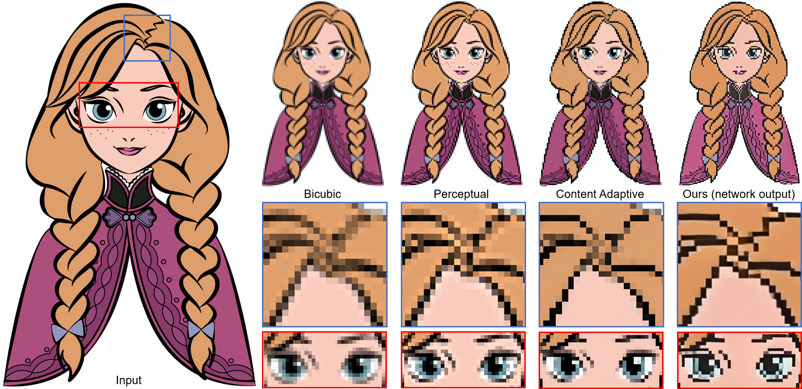

# Deep-Unsupervised-Pixelization
## Paper
[Deep Unsupervised Pixelization](http://www.shengfenghe.com/uploads/1/5/1/3/15132160/sa2018_pixelization.pdf) and [Supplementary Material](http://www.shengfenghe.com/uploads/1/5/1/3/15132160/sa2018_supp.pdf).  

Chu Han^, Qiang Wen^, Shengfeng He*, Qianshu Zhu, Yinjie Tan, Guoqiang Han, and Tien-Tsin Wong. (^joint first authors)

ACM Transactions on Graphics (SIGGRAPH Asia 2018 issue), 2018.  
## 
## Requirement
- Python 3.5
- PIL
- Numpy
- Pytorch 0.4.0
- Ubuntu 16.04 LTS
## Dataset
### Training Dataset
We collect 900 clip arts and 900 pixel arts for trianing our method. The folders named `trainA` and `trainB` contain the clip arts and pixel arts respectively [here](https://drive.google.com/open?id=1qDXB5g0Cb0VwISXwnfeiehPHuTgxWhdG).
### Testing Dataset
Create the folders `testA` and `testB` in the directory `./samples/`. Note that `testA` and `testB` contain the clip arts to be pixelized and pixel arts to be depixelized respectively.
## Training
* To train a model:
``` bash
python3 ./train.py --dataroot ./samples --resize_or_crop crop --gpu_ids 0
```  
or you can directly:
``` bash 
$ bash ./train.sh
```  
You can check the losses of models in the file `./checkpoints_pixelization/loss_log.txt`.  
More training flags in the files `./options/base_options.py` and `./options/train_options.py`.
## Testing
* After training, all models have been saved in the directory `./checkpoints_pixelization/`.
* To test a model:
``` bash
python3 ./test.py --dataroot ./samples --no_dropout --resize_or_crop crop --gpu_ids 0 --how_many 1 --which_epoch 200
```  
or you can directly:
``` bash 
$ bash ./test.sh
```  
More testing flags in the file `./options/base_options.py`.  
All testing results will be shown in the directory `./results_pixelization/`.
## Note
Since the pretrained model has been used in commerce, it has not been released.
## Acknowledgments
Part of the code is based upon [pytorch-CycleGAN-and-pix2pix](https://github.com/junyanz/pytorch-CycleGAN-and-pix2pix).
## Citation
```
@article{han2018deep,
  title={Deep unsupervised pixelization},
  author={Han, Chu and Wen, Qiang and He, Shengfeng and Zhu, Qianshu and Tan, Yinjie and Han, Guoqiang and Wong, Tien-Tsin},
  journal={ACM Transactions on Graphics (TOG)},
  volume={37},
  number={6},
  pages={1--11},
  year={2018},
  publisher={ACM New York, NY, USA}
}
```
